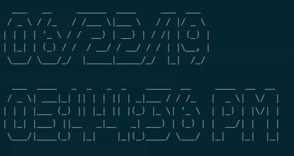
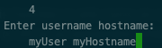
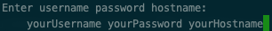
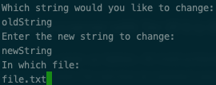

# Scripts

<div style="text-align: justify"> 

This repo is a combination of the bash functions that I use often.

## Usage

For macOS and Linux users, after downloading the repository folder, you can execute command below. SOCKS settings are not applied to Linux users in these scripts.
```
./AllFunctions
```
After executing the command above, you will see a menu as below:

> Which function would you like to use?
> 1) [Time](###-**Time**)
> 2) [Tor](###-**Tor**)
> 3) [Socks [on/off]](###-**Socks-[on/off]**)
> 4) [Initialize Server with SSH](###-**Initialize-Server-with-SSH**)
> 5) [Connect to a server (If it is the first time, execute 4)](###-**Connect-to-a-server-\(If-it-is-the-first-time,-execute-4\)**)
> 6) [Connect to a server with Tor (If it is the first time, execute 4)](###-**Connect-to-a-server-with-Tor-\(If-it-is-the-first-time,-execute-4\)**)
> 7) [Word Replacement](###-**Word-Replacement**)

You can also execute them seperately in the `scripts/` folder by:
```
./[function_name]
```

### **Time**

You need to install `figlet` in order to use this function. This function prints a simple date and time to your console and updates it in every second.



### **Tor**

You need to install `tor` in order to use this function. If tor is not running, this function will automatically start tor and turn on the SOCKS proxy in your network settings. It will do opposite in vice versa. Before executing this function, you have to add localhost:9050 to your SOCKS proxy setting in network settings.

### **Socks [on/off]**

This function is only turns on or off your SOCKS proxy setting without starting Tor. You need to specify the status on or off as an arguement after the function number:

On:
```
3 on 
```
Off:
```
3 off
``` 

### **Initialize Server with SSH**

This is a regular SSH connection for a web server. After entering the function number, it will ask your username and hostname:



### **Connect to a server (If it is the first time, execute 4)**

You need to install `sshpass`. This function is a regular SSH connection as well but, as you know, with a regular SSH connection, it will ask you a password as a prompt after entering your information. However, this function is asking you all of them together. Therefore, for the first run, you should execute function 4 to have the authentication. Then, you can use this function. 



If you execute `ConnectToServer` script file seperately. You can choose your servers. When you execute it, it will ask you `Which server would you like to connect?`. You have two options by default. You can edit it as you wish. The first option is `server1`. In order to use it, you have to add your information to there as below. On the other hand, you can choose `server2` and enter all information.

Change `yourPassword` to your password and `yourUsername@yourHostname` to your username and your hostname.

```
server1) sshpass -p yourPassword ssh yourUsername@yourHostname
```

After that, you can connect to your server without entering all information again and again by using this:

```
./scripts/ConnectToServer
```

It will prompt you `Which server would you like to connect?`. Just enter `server1`. Now, you will be connected to your web server.

### **Connect to a server with Tor (If it is the first time, execute 4)**

This function same as below. All instructions can be applied to this function as well. The only difference is that this function uses Tor service to connect your web server. So, you can also use your `.onion` address for your web server.

### **Word Replacement**

This function is a basic find and replace feature. Change `oldString` with the word you want to change, `newString` with the new word and `file.txt` with the file you want to change. You will find the output file as `filenew.txt`.




</div>